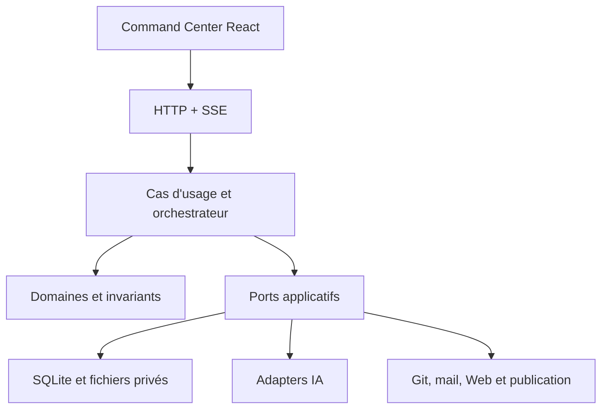

# DevCom Command Center — Architecture globale V1

Statut : proposition de référence à valider avant implémentation.
Date : 7 octobre 2026. Nom de travail : DevCom Command Center.

## 1. Finalité et définition de la V1

Application locale pour Jérôme/DevCom81 : coordonner des spécialistes IA, préparer des décisions techniques, traiter les échanges professionnels, qualifier des prospects et préparer des publications. Chaque action engageante reste sous contrôle humain. Le dépôt public démontre les compétences de conception, DDD, architecture hexagonale, SOLID, tests, sécurité, intégration et UX.

La V1 finale doit être utilisable au quotidien, pas une maquette : données persistantes, appels IA réels, erreurs traitées, coûts suivis, validations humaines, historique consultable et restauration documentée. Sa construction commence par TECH puis ajoute les autres parcours dans le même noyau.

Deux modes distincts :

- **Démo** : données fictives, réponses déterministes, aucun secret ni action externe ; parcours reproductible sans compte payant, clairement signalé dans l'interface.
- **Personnel** : projets et intégrations réels, credentials privés, appels facturés autorisés, protections du moteur actives.

## 2. Trajectoire

| Version | Contenu |
|---|---|
| V1 | Application navigateur locale, moteur durable, HQ interactif, TECH, projets, budgets, MAIL, SALES et SOCIAL |
| V2 | Service `systemd --user`, tâches planifiées en arrière-plan, notifications D-Bus/libnotify |
| V3 | QG 2D/isométrique ; personnages reflétant les états réels |
| V4 éventuelle | Personnages 3D après validation de l'utilité et du coût matériel |

La V1 inclut déjà événements et notifications internes. Ni daemon permanent ni personnages ne sont requis pour sa livraison.

## 3. Stack retenue

| Couche | Choix | Rôle |
|---|---|---|
| Moteur | Python 3.12+, asyncio | Orchestration et concurrence bornée |
| API | FastAPI, Pydantic v2 | Validation des échanges et API HTTP |
| Domaine | Python pur, dataclasses/value objects | Invariants sans dépendance à FastAPI, ORM ou SDK IA |
| Persistance | SQLite, SQLAlchemy 2, Alembic | État, migrations, audit, budgets, file de tâches |
| Interface | React, TypeScript strict, Vite | Command Center local |
| Données UI | TanStack Query | État serveur, mutations et invalidation |
| État UI | Zustand si nécessaire | État visuel partagé uniquement |
| Animation | Motion/Framer Motion | États d'agents et transitions sobres |
| Temps réel | SSE + commandes HTTP | Flux serveur vers navigateur ; reconnexion et reprise |
| Tests | pytest ; Vitest/Testing Library ; Playwright | Domaine, intégrations et parcours critiques |
| Qualité | Ruff, mypy ; ESLint, tsc | Lisibilité, typage et dépendances |
| Fournisseurs IA | Adapters OpenAI, Anthropic, Gemini | Un premier fournisseur réel, puis extension sans modifier le domaine |

Les versions exactes sont vérifiées lors du lot de fondation puis verrouillées. Aucun tarif ou nom de modèle provenant d'une ancienne conversation ne devient une constante. Les prix, limites et capacités sont des paramètres versionnés avec date de vérification.

SSE est suffisant pour la V1 ; WebSocket seulement si un besoin bidirectionnel justifié apparaît. Le build React est servi par FastAPI en usage local ; Vite sert au développement. Aucun besoin initial de Redis, Celery, microservices ou Electron.

## 4. Architecture : monolithe modulaire hexagonal



Les adapters implémentent les ports. Le domaine ne dépend ni des adapters ni des frameworks. Le point de composition construit les dépendances ; aucun service locator global. Les transactions et l'ordonnancement appartiennent à l'application. Les prompts sont des ressources versionnées, pas une couche de sécurité.

### Modules et propriétaires des règles

| Module | Responsabilité |
|---|---|
| projects | Mémoire commune, versions du contexte, documents, décisions et ADR |
| agents | Identités, contrats de compétences, états et résultats structurés |
| missions | Missions, tâches, analyses, propositions, workflow TECH et conversations |
| governance | Permissions, approbations, validations de scope et blocages |
| billing | Tarifs, réservations, consommation, plafonds et rapprochement |
| communication | Messages, brouillons et notifications internes |
| sales | Prospects, qualification, étapes de prospection et suivi |
| social | Idées, contenus, calendrier et préparation de publication |
| integrations | Configuration des connexions, statut, références de secrets |
| audit | Événements durables et traces de décisions/actions |

Pas de modèle ORM commun géant. Chaque module possède ses agrégats et ses repositories ; les échanges passent par des contrats explicites et identifiants. Des objets transverses limités : ID, montant, horodatage, références d'artefacts et d'événements.

### Arborescence cible

```text
AGENTS.md
ARCHITECTURE.md
README.md
backend/
  pyproject.toml
  src/devcom/
    bootstrap/
    modules/
      projects/
        domain/
        application/
        ports/
        adapters/
      agents/
      missions/
      governance/
      billing/
      communication/
      sales/
      social/
      integrations/
      audit/
    entrypoints/http/
    shared/
  migrations/
  tests/{unit,integration}/
frontend/
  src/{app,features,shared}/
  tests/
contracts/
  agents/
  workflows/
  prompts/
docs/
  adr/
  slices/
  demo/
scripts/
e2e/
```

Les autres modules suivent la structure du module projects. Ne créer que les dossiers nécessaires aux tranches courantes. Les données personnelles, bases, fichiers importés, logs et secrets vivent hors du dépôt dans des répertoires locaux configurables.

## 5. Compétences et permissions

Le Capability Registry est déclaratif et versionné : agent, domaines autorisés, types de tâches, sorties attendues, outils autorisés et exclusions. Toute tâche porte une capacité requise. Le moteur refuse l'affectation et l'accès aux outils incompatibles.

| Agent | Périmètre | Exclusions principales |
|---|---|---|
| Architecte | DDD, hexagonal, SOLID, frontières, dépendances, évolution et dette | Arbitrage humain, commerce, envoi, modification de code |
| Cyber | Menaces, auth, droits, secrets, exposition, vulnérabilités et mitigations | Architecture globale, UX, commerce |
| QA | Tests, cas limites, testabilité, régressions et critères d'acceptation | Classification de mails, choix d'architecture |
| DevOps | Livraison, infrastructure, observabilité, disponibilité, rollback et coûts infra | Modèle métier, prospection |
| FullStack | Faisabilité frontend/backend/API et performances applicatives | Arbitrage global, stratégie commerciale |
| SQL/Data | Schémas, intégrité, transactions, index et migrations | UX, déploiement global, commerce |
| Synthétiseur TECH | Synthèse des avis, options et désaccords documentés | Expertise inventée, décision à la place de Jérôme |
| Vendeur | Recherche, qualification, argumentaire et suivi commercial | Architecture, audit Cyber, expertise technique |
| Secrétaire | Tri de mails, résumés, brouillons et routage | Stratégie commerciale, expertise technique |
| Social | Ligne éditoriale, idées, contenus et calendrier | Prospection directe, architecture, traitement des mails |
| Dispatcher | Classification de l'intention et proposition de routage | Toute recommandation sur le fond |

Le Dispatcher suggère un routage ; l'orchestrateur le valide contre le registre. Une ambiguïté demande une clarification. Une mission mixte se décompose en tâches bornées. Un agent refuse par `OUT_OF_SCOPE` ou transmet un `OutOfScopeFinding` ; il ne traite pas lui-même le sujet.

La validation des outils et types de tâches est déterministe. L'appartenance sémantique d'un texte à un domaine ne peut pas être garantie par un schéma : contrôles complémentaires, rejet des sorties non conformes et audit sont nécessaires. Ne jamais promettre qu'un LLM ne débordera jamais.

### Permissions

| Classe | Règle |
|---|---|
| READ | Lecture dans les sources explicitement configurées et autorisées |
| PROPOSE | Analyses et brouillons sans engagement externe |
| MODIFY | Données préparatoires dans l'application ; périmètre explicite |
| EXTERNAL | Envoi, publication, modification du dépôt ou autre action engageante : GO humain |

La lecture peut transmettre des données à un fournisseur IA : configuration des sources et politique d'envoi vérifiées avant l'appel. Les clés et secrets sont exclus des contextes.

Une approbation lie action, cible, contenu exact, hash, version, durée de validité et identité de l'utilisateur. Modifier le contenu invalide le GO. Exécution avec contrôle atomique et clé d'idempotence ; aucun bouton frontend ne remplace le contrôle backend. Le choix d'une option TECH n'autorise pas son implémentation.

## 6. Workflow TECH de bout en bout

1. Sélection du projet et formulation de la mission ; lecture des pièces autorisées.
2. Vérification des informations : les inconnues importantes interrompent la préparation avec des questions ciblées.
3. Snapshot versionné du contexte, routage validé, estimation et réservation du budget.
4. Analyses indépendantes des six spécialistes avec concurrence bornée.
5. Contradiction structurée : chaque expert examine les points qui touchent son domaine ; un round par défaut, un round supplémentaire maximum si autorisé et financé.
6. Réponses aux objections et synthèse : options comparables, preuves, risques, tests, coûts estimés et désaccords conservés.
7. Présentation A/B/C quand trois alternatives crédibles existent ; une ou deux sinon. Ne jamais fabriquer une option pour remplir l'écran.
8. Choix humain ; création de l'ADR et du plan d'implémentation.
9. Prévisualisation exacte du paquet Cursor ; modification ou annulation possible.
10. GO distinct ; export manuel utilisable dès V1. Adapter automatisé uniquement après vérification des capacités réelles de Cursor.
11. Import du diff/rapport de Cursor, revue spécialisée, corrections et validation humaine.

Cyber peut signaler un risque critique ; une politique déterministe place alors la proposition en état bloqué. L'agent ne dispose pas d'un veto autonome général. L'utilisateur voit le motif, les preuves et les conditions de levée ; toute dérogation explicite est auditée.

### Contrats structurés

DTO Pydantic aux frontières, mapping vers les objets de domaine :

- `MissionRequest` : project_id, question, artifact_refs, limites et critères attendus.
- `TaskAssignment` : mission_id, agent_id, capability, context_snapshot_id, deadline, budget_reservation_id.
- `AgentResult` : statut, findings, unknowns, source_refs, out_of_scope_findings.
- `Finding` : domaine, observation, evidence_refs, niveau de risque, recommandation et hypothèses.
- `Challenge` : finding/proposal ciblé, objection, preuves, correction demandée.
- `Proposal` : solution, avantages, risques, compromis, validations, effort estimé et références aux avis.
- `Decision` : option/version choisie, motif humain, auteur et date.
- `ApprovalRequest` : action, cible, hash du payload, version et expiration.
- `UsageRecord` : fournisseur/modèle, tokens entrée/cache/sortie, outils, tarif utilisé et coût.

Aucun stockage ni affichage d'une chaîne de pensée privée. Conserver les conclusions, justifications synthétiques, preuves et décisions.

## 7. Durabilité, événements et concurrence

États mission (cible V1) : draft, awaiting_clarification, queued, running, awaiting_decision, awaiting_approval, completed, failed, cancelled, paused_budget.

États mission retenus dès le LOT 1 (routage borné, sans exécution d'agents) :

| État | Signification |
|---|---|
| `draft` | Mission créée, routage en cours d'application |
| `awaiting_clarification` | Demande non reconnue ou ambiguë ; choix structurés requis |
| `routed` | Tâches validées contre le Capability Registry ; consultable, sans lancement d'analyses |
| `blocked_authorization` | Intention EXTERNAL détectée sans action concrète versionnée ; message « Autorisation requise — action à préciser » ; pas d'`ApprovalRequest` ni d'exécution |

`awaiting_approval` est réservé aux lots ultérieurs lorsqu'une action EXTERNAL concrète (cible, contenu, hash) est prête pour un GO. Transitions LOT 1 testées : `draft` → `awaiting_clarification` \| `routed` \| `blocked_authorization` ; `awaiting_clarification` → `routed` \| `blocked_authorization` \| `awaiting_clarification` après réponse valide.

États agent : idle, queued, working, waiting_human, completed, warning, error, offline. L'UI montre des étapes réelles ; pas de pourcentage de réflexion inventé.

SQLite conserve tâches, tentatives, leases et résultats. Un worker local reprend les tâches récupérables au redémarrage ; `asyncio` sert à exécuter, pas à conserver la file. Timeouts, tentatives et taille de contexte bornés. Les appels facturés ne sont pas rejoués aveuglément après un timeout ambigu.

Transactions courtes, WAL, gestion des locks et un worker principal en V1. Les appels réseau se font hors transaction. Sauvegarde cohérente via mécanisme SQLite adapté, pas simple copie d'un fichier actif.

Événement : id, type, aggregate_id, version, occurred_at UTC, correlation_id, payload minimal. État et événement sont écrits atomiquement via outbox. Consommateurs idempotents. Livraison au moins une fois ; pas de promesse de traitement exactement une fois.

SSE utilise des identifiants persistants, reprise après reconnexion et resynchronisation HTTP si le curseur a expiré. Les notifications internes peuvent être lues/archivées. V2/V3 deviennent des consommateurs supplémentaires.

## 8. Mémoire et artefacts

La mémoire appartient au projet : description, stack, contraintes, règles métier, dépôts, documents, ADR et décisions. Chaque mission utilise un snapshot traçable. Une contradiction avec la mémoire déclenche une clarification ; aucun agent ne réécrit silencieusement une décision validée.

Contexte minimal par domaine, budget de tokens et références de sources. Le cache fournisseur est une optimisation opportuniste, distincte de la mémoire persistante ; aucune économie garantie. Les artefacts sont versionnés : rapport, ADR, plan Cursor, email, post et dossier prospect.

## 9. Budget et mesure

Plafond initial configurable : 50 € par mois pour les dépenses mesurées par l'application ; sous-budgets par agent, mission et recherche. Montants en unités monétaires entières suffisamment fines, jamais float. Prix en devise fournisseur, conversion datée explicite et estimation des taxes séparée si nécessaire.

Avant tout appel : réserver atomiquement le coût majoré selon tokens maximum, sortie maximum, outils et tarifs connus. Concurrence incluse. Refuser si le plafond restant est insuffisant. Après appel : rapprocher avec l'usage réel et libérer le reliquat. Prix inconnu ou appel non bornable : suspension et choix humain.

Séparer coût estimé, réservé, confirmé et incertain. Après timeout, conserver une réserve conservatrice. Pas de retries illimités ni boucle de débat. Seuils de notification et bouton pause global.

Le plafond applicatif protège les appels qu'il pilote ; il ne garantit pas le total d'une facture fournisseur comprenant d'autres clients, taxes ou ajustements. Utiliser des clés/projets dédiés et les limites fournisseur quand disponibles. Les budgets annoncés précédemment sont des hypothèses, pas des tarifs validés.

## 10. Autres parcours V1

### MAIL

Connexion au compte réellement utilisé par DevCom81, à confirmer avant le lot. Import/lecture incrémentale, classement, résumé, rattachement aux prospects, brouillon modifiable, prévisualisation du destinataire et du contenu, GO puis envoi avec résultat traçable. Aucun effacement automatique de spam. Fournir un mode fichier de démonstration et un connecteur réel validé.

### SALES

Mission et critères géographiques/métier explicites ; recherches bornées et sourcées avec dates, dédoublonnage, qualification expliquée, contact vérifié, dossier puis brouillon. Pipeline : repéré, qualifié, brouillon prêt, contacté, réponse, devis, gagné/perdu. Ne jamais inférer une reprise ou une identité sans preuve. Une réponse entrante est rattachée au dossier ; le Vendeur prépare l'argumentaire, le Secrétaire prépare l'envoi.

### SOCIAL

Historique importable, idées, variantes distinctes, retouches conversationnelles, version choisie et calendrier. Export/copier manuellement disponible dans la V1. Publication native seulement si un accès API autorisé est réellement disponible ; autrement statut « prêt à publier manuellement », jamais faux succès. L'absence de connecteur ne bloque pas la préparation quotidienne.

## 11. Interface vivante et accessible

HQ : cartes d'agents, états, événements, décisions en attente, budget et lancement de missions. Espaces : TECH, SALES, MAIL, SOCIAL, Projects, Journal et Settings. Détails des missions : analyses, contradictions, propositions, coût et actions.

Animations légères, identité visuelle par agent, notifications non intrusives, navigation clavier, focus visible, contraste lisible et préférence de mouvement réduit. Une alerte ou décision reste visible après disparition du toast. Fun sans cacher erreurs, dépenses, blocages ou actions réelles.

Le frontend manipule agents, missions, artefacts et approbations ; aucune clé fournisseur, connexion Gmail ou SDK IA côté navigateur.

## 12. Sécurité locale et dépôt public

Serveur lié à loopback ; protection de session locale, validation Host/Origin et protection CSRF adaptée aux mutations. CORS limité ; ne pas supposer que localhost est automatiquement sûr. Accès filesystem limité aux sources configurées, fichiers importés traités comme non fiables.

Secrets dans un stockage local protégé ou gestionnaire de credentials, référencés par ID ; jamais dans SQLite en clair sans décision explicite, prompts, logs ou exports. Redaction des logs. Les contenus de mails, Web et code sont des données non fiables : leurs instructions ne donnent aucune permission supplémentaire.

Dépôt public : `.env.example` sans valeurs, exclusions pour données locales, fixtures fictives, détection de secrets, documentation de démarrage et captures anonymisées. Licence et nom définitif à choisir avant publication. Aucune publication de dépôt ou de données sans instruction de Jérôme.

## 13. Construction par tranches verticales

Chaque tranche inclut domaine, cas d'usage, persistance/migrations si utiles, API, UI, erreurs, tests et parcours humain. Aucun lot « tout le backend puis tout le frontend ».

| Lot | Résultat démontrable | Validation essentielle |
|---|---|---|
| 0 | Fondation, démarrage local, mode démo, premier projet et HQ | Créer un projet, redémarrer, le retrouver |
| 1 | Compétences, permissions, Dispatcher et mission bornée | QA refuse une classification de spam ; routage ambigu demande clarification |
| 2 | Mission TECH complète avec adapters fictifs | Avis, contradiction, propositions, choix et ADR via UI |
| 3 | Budget et premier fournisseur IA réel | Réservation concurrente, refus au plafond, résultat réel et coût |
| 4 | TECH durable, erreurs et SSE | Reconnexion, redémarrage, annulation et absence de duplication |
| 5 | Plan Cursor, GO séparé, export et retour de diff | Choix sans modification du code ; revue de l'implémentation importée |
| 6 | MAIL quotidien sur un compte réel | Lire, classer, préparer puis envoyer uniquement après GO |
| 7 | SALES réel, sources et relais MAIL | Prospect sourcé, dossier, brouillon, réponse rattachée |
| 8 | SOCIAL quotidien | Historique, variantes, retouche, version finale et export/publication disponible |
| 9 | Stabilisation et démonstration globale | Sauvegarde/restauration, installation documentée et parcours multiéquipes |

Le lot 3 active les appels payants seulement après validation des garde-fous. Chaque lot est subdivisé si plusieurs règles exigent des validations séparées. L'ordre peut être ajusté par décision explicite, sans retirer une condition de livraison.

## 14. Définition de terminé

La V1 est livrée quand TECH réel, MAIL connecté, SALES sourcé et SOCIAL utilisable fonctionnent depuis le même HQ ; mémoire, coûts, décisions et historiques survivent au redémarrage ; les actions engageantes exigent leur GO ; les incidents sont compréhensibles et récupérables ; la sauvegarde/restauration est éprouvée ; la démo sans secrets est reproductible depuis un clone neuf.

Les validations build/tests sont lancées manuellement par Jérôme. La CI peut être configurée mais n'est jamais utilisée pour contourner ce choix. README, ADR, contrat des agents, captures fictives et scénario de démonstration rendent les compétences visibles sans exposer les projets clients.

## 15. Décisions à confirmer avant les lots concernés

Nom définitif et licence publique ; fournisseur/modèle du premier appel réel ; compte/protocole mail ; moteur de recherche et plafond associé ; périmètre exact d'accès filesystem ; capacités d'intégration Cursor et LinkedIn. Ces inconnues ne bloquent pas la conception ni la démo, mais aucune intégration réelle n'est inventée pour les remplacer.
